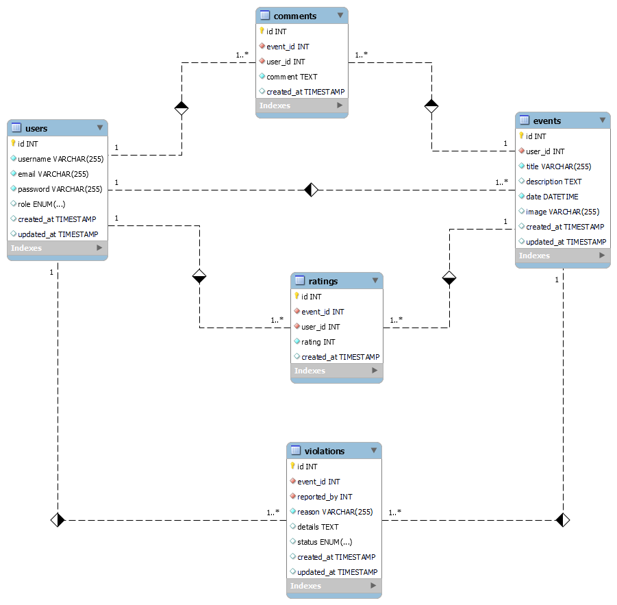

# Projekt: Veranstaltungskalender für Ford Fiesta (11/2001–08/2008)

### Nutzungsbedingungen

Bitte lies unsere [Nutzungsbedingungen](TERMS.md) sorgfältig durch, bevor du dieses Projekt verwendest oder weiterverwendest.

## Übersicht
Eine spezialisierte Plattform für Besitzer und Enthusiasten des Ford Fiesta (Modelljahr 11/2001–08/2008). Benutzer können Events finden, hinzufügen, bewerten und kommentieren. Events können Auto-Treffen, Reparatur-Workshops und Ausfahrten umfassen.

### Wichtige Komponenten und Funktionen

#### Benutzerverwaltung
- **Registrierung und Anmeldung**: Benutzer können sich registrieren und anmelden, um Events zu verwalten. JWToken wird zur Benutzerverwaltung und Authentifizierung verwendet.
- **Profilverwaltung**: Benutzer können ihre Profile verwalten und persönliche Daten aktualisieren.

#### Event-Verwaltung
- **Event-Erstellung**: Benutzer können neue Events hinzufügen mit Details wie Titel, Beschreibung, Datum, Ort und Bild.
- **Event-Bearbeitung**: Benutzer können ihre eigenen Events bearbeiten.
- **Event-Löschung**: Benutzer können ihre eigenen Events löschen.
- **Event-Bewertung und Kommentare**: Benutzer können Events bewerten und Kommentare hinterlassen.
- **Event-Kalender**: Kalenderansicht zur Anzeige aller kommenden Events.

#### Benachrichtigungen und Erinnerungen
- **E-Mail-Benachrichtigungen**: Benutzer können sich für E-Mail-Benachrichtigungen für bevorstehende Events anmelden.
- **Push-Benachrichtigungen**: Optional können Push-Benachrichtigungen für neue oder bevorstehende Events implementiert werden.

#### Event-Suche und Filterung
- **Nach Datum filtern**: Benutzer können Events nach Datum filtern.
- **Nach Ort filtern**: Benutzer können Events nach Ort filtern.
- **Nach Kategorie filtern**: Benutzer können Events nach Kategorie (z.B. Treffen, Workshop, Ausfahrt) filtern.

### Technische Komponenten und Architektur

1. **Frontend**
   - **Technologie**: React
   - **Beschreibung**: Eine benutzerfreundliche Oberfläche zur Verwaltung und Anzeige von Events. Statische Dateien werden in AWS S3 gehostet und über CloudFront bereitgestellt.

2. **Backend**
   - **Technologie**: Express API
   - **Beschreibung**: API zur Verwaltung der Datenbankoperationen (CRUD) für Benutzer und Events.
   - **Auth**: JWToken für Benutzerauthentifizierung und -verwaltung.

3. **Datenbank**
   - **Technologie**: MySQL
   - **Beschreibung**: Speicherung von Benutzerdaten, Events und Bewertungen. Gehostet auf AWS RDS.

4. **Deployment**
   - **Backend**: Gehostet auf AWS EC2
   - **Datenbank**: Gehostet auf AWS RDS
   - **Statische Dateien**: Gehostet auf AWS S3
   - **Content Delivery**: AWS CloudFront zur Beschleunigung der Auslieferung der statischen Dateien.
   - **Autoscaling**: AWS Autoscaling Groups zur automatischen Skalierung der Backend-Server.

---
# Datenstruktur und -management

## Tabellenstruktur

1. **users**  
   Diese Tabelle speichert die Benutzerinformationen.
   - **id** (Primary Key, Auto-Increment)
   - **username** (VARCHAR, unique)
   - **email** (VARCHAR, unique)
   - **password** (VARCHAR)
   - **role** (ENUM: 'user', 'admin') - Rolle des Benutzers
   - **created_at** (DATETIME) - Zeitstempel der Erstellung
   - **updated_at** (DATETIME) - Zeitstempel der letzten Aktualisierung

2. **events**  
   Diese Tabelle speichert die Events, die Benutzer erstellen.
   - **id** (Primary Key, Auto-Increment)
   - **user_id** (Foreign Key zu `users.id`) - Der Benutzer, der das Event erstellt hat
   - **title** (VARCHAR)
   - **description** (TEXT)
   - **date** (DATETIME) - Datum und Uhrzeit des Events
   - **image** (VARCHAR) - Pfad zum Eventbild
   - **created_at** (DATETIME) - Zeitstempel der Erstellung
   - **updated_at** (DATETIME) - Zeitstempel der letzten Aktualisierung

3. **ratings**  
   Diese Tabelle speichert die Bewertungen zu Events.
   - **id** (Primary Key, Auto-Increment)
   - **event_id** (Foreign Key zu `events.id`) - Das Event, das bewertet wurde
   - **user_id** (Foreign Key zu `users.id`) - Der Benutzer, der die Bewertung abgegeben hat
   - **rating** (INT) - Bewertung (1-5)
   - **created_at** (DATETIME) - Zeitstempel der Erstellung

4. **comments**  
   Diese Tabelle speichert die Kommentare zu Events.
   - **id** (Primary Key, Auto-Increment)
   - **event_id** (Foreign Key zu `events.id`) - Das Event, zu dem der Kommentar gehört
   - **user_id** (Foreign Key zu `users.id`) - Der Benutzer, der den Kommentar abgegeben hat
   - **comment** (TEXT)
   - **created_at** (DATETIME) - Zeitstempel der Erstellung

5. **violations**  
   Diese Tabelle speichert die gemeldeten Verstöße.
   - **id** (Primary Key, Auto-Increment)
   - **event_id** (Foreign Key zu `events.id`) - Das Event, das gemeldet wurde
   - **reported_by** (Foreign Key zu `users.id`) - Der Benutzer, der den Verstoß gemeldet hat
   - **reason** (VARCHAR) - Grund für die Meldung
   - **details** (TEXT) - Details zur Meldung
   - **status** (ENUM: 'pending', 'reviewed', 'resolved') - Status der Meldung
   - **created_at** (DATETIME) - Zeitstempel der Erstellung
   - **updated_at** (DATETIME) - Zeitstempel der letzten Aktualisierung

## Beziehungen

- **users** ↔ **events**: Ein Benutzer kann viele Events erstellen (One-to-Many).
- **users** ↔ **ratings**: Ein Benutzer kann viele Bewertungen abgeben (One-to-Many).
- **users** ↔ **comments**: Ein Benutzer kann viele Kommentare schreiben (One-to-Many).
- **users** ↔ **violations**: Ein Benutzer kann viele Verstöße melden (One-to-Many).
- **events** ↔ **ratings**: Ein Event kann viele Bewertungen haben (One-to-Many).
- **events** ↔ **comments**: Ein Event kann viele Kommentare haben (One-to-Many).
- **events** ↔ **violations**: Ein Event kann viele Verstöße haben (One-to-Many).

### ER-Diagramm

</img>

### Das Schema für die Datenbank ist in der folgenden SQL-Datei:

[Download des Datenbankschemas](scripts/veranstaltungskalender_ford_fiesta.sql)

#### Verwendung

Um das Schema anzuwenden, führe das SQL-Skript wie folgt aus:

1. Lade die SQL-Datei herunter.
2. Verbinde dich mit deiner Datenbank.
3. Führe das SQL-Skript aus, um die Tabellen zu erstellen.

---

# Sicherheit und Datenschutz
- **Datenverschlüsselung**: Stellt sicher, dass sensible Daten wie Passwörter und persönliche Informationen verschlüsselt gespeichert werden.
- **Datenschutzrichtlinien**: Implementiere klare Datenschutzrichtlinien und stelle sicher, dass Benutzer über die Verwendung ihrer Daten informiert sind.

## Technische Komponenten im Detail

### Frontend (React)
- **State Management**: Nutze Context API zur Verwaltung des globalen Zustands.
- **Routing**: Verwende React Router für die Navigation zwischen verschiedenen Seiten (Login, Eventliste, Eventdetails, Eventerstellung).
- **Formulare**: Verwende Formik und Yup zur Validierung und Verwaltung von Formularen (Registrierung, Login, Eventerstellung).

### Backend (Express API)
- **Middleware**: Nutze Middleware wie `body-parser` zur Verarbeitung von JSON-Daten und `cors` zur Handhabung von Cross-Origin-Requests.
- **Sicherheitsmaßnahmen**: Implementiere Sicherheitsmaßnahmen wie Rate Limiting  
  - Schutz vor DDoS-Angriffen: Rate Limiting hilft, die Anzahl der Anfragen pro Zeiteinheit zu begrenzen, was hilft, deine Server vor übermäßigem Traffic zu schützen, der durch Distributed Denial-of-Service (DDoS) Angriffe verursacht werden könnte.

  - Verhinderung von Brute-Force-Angriffen: Durch das Begrenzen der Anzahl von Anfragen pro Benutzer oder IP-Adresse kannst du Brute-Force-Angriffe erschweren, bei denen Angreifer durch wiederholtes Ausprobieren von Passwörtern oder Zugangsdaten versuchen, unbefugten Zugriff zu erhalten.

  - Stabilität und Leistungsoptimierung: Indem du die Anzahl der gleichzeitigen Anfragen kontrollierst, kannst du sicherstellen, dass deine Server stabil bleiben und eine gleichbleibende Leistung für alle Benutzer bieten.

  - Kostenkontrolle: Rate Limiting kann auch helfen, Kosten zu kontrollieren, indem unnötiger oder missbräuchlicher Traffic reduziert wird, der zusätzliche Serverressourcen und Bandbreite verbraucht.

### Datenbank (MySQL)
- **ORM**: Nutze ein ORM wie Sequelize zur Verwaltung der Datenbankoperationen und zur Vereinfachung der Datenbankabfragen.
- **Backups**: Regelmäßige Backups der Datenbank zur Sicherstellung der Datenintegrität.

Das sieht nach einer soliden Dokumentation der API-Endpunkte aus. Hier sind einige Vorschläge, um die Übersichtlichkeit und Verständlichkeit weiter zu verbessern:

### Ergänzungen und Verbesserungsvorschläge:

1. **Zusätzliche Informationen zu den Endpunkten:**
   - **Parameter:** Für jede Route, die Parameter akzeptiert (z.B. `:id`), könnte eine kurze Beschreibung hinzugefügt werden, was diese Parameter repräsentieren.
   - **Beispiele:** Es kann hilfreich sein, für einige der Endpunkte Beispiele für Anfragen und Antworten hinzuzufügen.
   - **Status-Codes:** Erwäge, die möglichen HTTP-Status-Codes für jede Route zu dokumentieren, um klarzustellen, was bei Erfolg oder Fehler zurückgegeben wird.

2. **Konsistenz der Beschreibung:**
   - Achte darauf, dass die Beschreibung der Routen konsistent ist. Z.B. könntest du bei jeder Route angeben, ob sie authentifiziert werden muss und welche Daten im Body (bei POST/PUT) erwartet werden.

# API-Endpunkte

### Benutzer API-Endpunkte

#### Benutzer
- **POST** `/api/auth/register`: Registrierung eines neuen Benutzers.
  - **Erforderliche Felder:** `username`, `password`, `email`
  - **Antwort:** Erfolgreiche Registrierung gibt eine Benutzer-ID zurück.

- **POST** `/api/auth/login`: Anmeldung eines Benutzers.
  - **Erforderliche Felder:** `email`, `password`
  - **Antwort:** Bei Erfolg wird ein Token zurückgegeben.

- **GET** `/api/user/profile`: Abrufen der Benutzerdaten.
  - **Header:** `Authorization: Bearer <token>`
  - **Antwort:** Gibt die Profilinformationen des angemeldeten Benutzers zurück.

- **PUT** `/api/user/profile/update`: Aktualisieren der Benutzerdaten.
  - **Geplant für zukünftige Implementierung**
  - **Header:** `Authorization: Bearer <token>`
  - **Erforderliche Felder:** Je nach Update, z.B. `email`, `password`
  - **Antwort:** Bestätigt die Aktualisierung der Daten.

  **Hinweis:** Die Implementierung wird später hinzugefügt. Sicherheitsüberlegungen, einschließlich Passwortverifizierung und E-Mail-Verifizierung, werden berücksichtigt.

#### Events
- **GET** `/api/user/events`: Abrufen aller Events eines Benutzers.
  - Header: Authorization: Bearer <token>
  - Antwort: Gibt eine Liste aller Events des angemeldeten Benutzers zurück.
  
- **POST** `/api/user/events/create`: Erstellen eines neuen Events durch den Benutzer.
  - **Erforderliche Felder:** `title`, `description`, `date`, `image`
  - **Antwort:** Gibt die ID des erstellten Events zurück.

- **PUT** `/api/user/events/update/`: Bearbeiten eines Events, das der Benutzer erstellt hat.
  - **Parameter:** `:id` - ID des zu bearbeitenden Events
  - **Parameter:** `UserId` - Prüfen ob der Benutzer das Event erstellt hat.
  - **Erforderliche Felder:** Je nach Update, z.B. `title`, `description`, `date`
  - **Antwort:** Bestätigt die Aktualisierung des Events.

- **DELETE** `/api/user/events/delete`: Löschen eines Events, das der Benutzer erstellt hat.
  - **Parameter:** `:id` - ID des zu löschenden Events
  - **Parameter:** `UserId` - Prüfen ob der Benutzer das Event erstellt hat.
  - **Antwort:** Bestätigt das Löschen des Events.

#### Bewertungen & Kommentare
- **POST** `/api/user/events/rate`: Hinzufügen einer Bewertung zu einem Event.
  - **Parameter:** `:id` - ID des Events
  - **Erforderliche Felder:** `rating` (1-5)
  - **Antwort:** Bestätigt die Hinzufügung der Bewertung.

- **POST** `/api/user/events/comment`: Hinzufügen eines Kommentars zu einem Event.
  - **Parameter:** `:id` - ID des Events
  - **Erforderliche Felder:** `comment`
  - **Antwort:** Bestätigt die Hinzufügung des Kommentars.

- **GET** `/api/user/events/event-feedback`: Abrufen aller Bewertungen eines Events.
  - **Parameter:** `:id` - ID des Events
  - **Antwort:** Liste aller Bewertungen zu dem Event.

## Admin API-Endpunkte

#### Dashboard
- **GET** `/api/admin/dashboard`: Abrufen von Dashboard-Daten.
  - **Antwort**: Übersichtsdaten wie Anzahl der Benutzer, Events, Verstöße.

#### Events

- **GET** `/api/admin/events`: Abrufen aller Events.
  - **Antwort**: Liste aller Events.

- **DELETE** `/api/admin/events/delete`: Löschen eines Events (unabhängig vom Ersteller).
  - **Parameter**: :id - ID des zu löschenden Events
  - **Antwort**: Bestätigt das Löschen des Events.

#### Kommentare

- **GET** `/api/admin/comments`: Abrufen aller Kommentare.
  - **Antwort**: Liste aller Kommentare.

- **DELETE** `/api/admin/comments/delete`: Löschen eines Kommentars (unabhängig vom Ersteller).
  - **Parameter**: :id - ID des zu löschenden Kommentars
  - **Antwort**: Bestätigt das Löschen des Kommentars.

#### Benutzer

- **GET** `/api/admin/users`: Abrufen aller Benutzer.
  - **Antwort**: Liste aller Benutzer.

- **DELETE** `/api/admin/users/delete`: Löschen eines Benutzers.
  - **Parameter**: :id - ID des zu löschenden Benutzers
  - **Antwort**: Bestätigt das Löschen des Benutzers.

- **PUT** `/api/admin/users/role`: Aktualisieren der Rolle eines Benutzers.
  - **Parameter**: :id - ID des Benutzers
  - **Erforderliche Felder**: role (z.B. 'admin' oder 'user')
  - **Antwort**: Bestätigt die Aktualisierung der Benutzerrolle.

#### Verstoßmeldungen

- **GET `/api/admin/violations`**: Abrufen aller gemeldeten Verstöße.
  - **Antwort**: Liste aller gemeldeten Verstöße.

- **PUT `/api/admin/violations/status`**: Aktualisieren des Status eines Verstoßes.
  - **Parameter**: :id - ID der Verstoßmeldung
  - **Erforderliche Felder**: status (z.B.'pending' oder 'resolved')
  - **Antwort**: Bestätigt die Statusaktualisierung.

## Visuelle Kennzeichnung für Admins und Benutzer

Um die Benutzerfreundlichkeit und Navigation in unserem System zu verbessern, haben wir visuelle Kennzeichnungen eingeführt, um zwischen Admins und normalen Benutzern zu unterscheiden. Hier sind die Details zur Implementierung:

### Dashboard-Design

- **Admin-Dashboard:**
  - **Farbe:** Das Admin-Dashboard verwendet eine auffällige Farbe oder ein spezielles Design, um sofort zu erkennen, dass es sich um Admin-Funktionen handelt.
  - **Header/Banner:** Ein klarer Hinweis oder ein Banner am oberen Rand des Dashboards kennzeichnet den Admin-Bereich.

- **Benutzer-Dashboard:**
  - **Farbe:** Ein neutraler oder standardmäßiger Farbton wird verwendet, der von der Admin-Kennzeichnung abweicht.
  - **Header/Banner:** Ein einfacher Header ohne spezielle Kennzeichnung.

### Benutzeroberfläche

- **Icons und Labels:**
  - **Admin:** Verwende ein Schild oder eine Krone neben den Benutzernamen in der Benutzerverwaltung, um Administratoren zu kennzeichnen.
  - **Benutzer:** Normale Icons oder Text für reguläre Benutzer.

- **Dropdown-Menü:**
  - Im Dropdown-Menü oder in der Sidebar wird neben dem Benutzernamen ein Label wie „Admin“ oder „User“ angezeigt.

### Farbcodierung

- **Admin:**
  - Verwende Farben wie Rot oder Blau, um die Admin-Bereiche hervorzuheben und sofortige Sichtbarkeit zu gewährleisten.

- **User:**
  - Verwende Farben wie Grün oder Grau, die sich von den Admin-Farben abheben.

### Tooltips

- **Hover-Effekte:**
  - Beim Überfahren mit der Maus werden zusätzliche Informationen über den Benutzerstatus angezeigt, z.B. „Administrator“ oder „Normaler Benutzer“.

### Designbeispiele

- **Admin-Bereich:**
  - Ein Dashboard mit großen Buttons und klaren, prägnanten Icons für Verwaltungsaufgaben.

- **Benutzer-Bereich:**
  - Ein einfaches Layout mit grundlegenden Funktionen und weniger Verwaltungsoptionen.

Durch diese visuelle Unterscheidung können Benutzer schnell erkennen, welche Funktionen ihnen zur Verfügung stehen und ob sie sich im Admin- oder Benutzerbereich befinden. Dies verbessert die Benutzerfreundlichkeit und sorgt für ein klareres Navigationsschema.

# UI Design für V FORD FIESTA EVENTS

## Designrichtlinien

### Farbschema
- Primärfarbe: #FF5733 (Orange)
- Sekundärfarbe: #C70039 (Dunkelrot)
- Hervorhebungsfarbe: #900C3F (Dunkelviolett)
- Hintergrundfarbe:  #F8F9FA (Hellgrau)

### Schriftarten
- Primäre Schriftart: Galindo
- Sekundäre Schriftart: Roboto

## Komponenten und Layout

### Header
- Gestaltung des Header mit Logo
### Navbar
- Gestaltung der Hauptnavigation mit Logo und Menüpunkten für Benutzeraktionen.

### Startseite
- Kachelansicht der neuesten Events mit Titel und Bildvorschau.

### Eventdetails
- Detailansicht eines Events mit Beschreibung, Datum und Ort.

### Eventerstellung
- Formular zur Erstellung neuer Events mit Feldern für Titel, Beschreibung, Datum, Ort und Bildupload.

### Profilseite
- Anzeige der Benutzerinformationen mit Optionen zum Bearbeiten des Profils.

## Nutzung von Bootstrap

### Grid-System
- Verwendung des Bootstrap Grids zur responsiven Gestaltung der Seitenlayouts.

### Komponenten
- Integration von Bootstrap-Komponenten wie Modals, Forms und Cards für eine konsistente Benutzeroberfläche.

### Anpassung der Farben
- Anpassung des Bootstrap-Farbschemas an die definierten Primär-, Sekundär- und Hervorhebungsfarben.

### Responsives Design
- Sicherstellung, dass das Design auf verschiedenen Bildschirmgrößen gut funktioniert, insbesondere auf Mobilgeräten.

## Nächste Schritte

1. **Farbschema festlegen**: Definiere die genauen Farbwerte für das Farbschema.✅
2. **Bootstrap integrieren**: Füge Bootstrap in das Projekt ein und passe es an die eigenen Farben an.✅
3. **Komponenten entwickeln**: Entwickle die UI-Komponenten basierend auf den Designrichtlinien.✅
4. **Prototyping**: Erstelle Prototypen und überprüfe das Design auf Benutzerfreundlichkeit.✅
5. **Implementierung**: Implementiere das Design in die React-Anwendung unter Verwendung von Bootstrap.✅
6. **Testing**: Führe Tests durch, um sicherzustellen, dass das UI gut funktioniert und benutzerfreundlich ist.

---

## Neue Features

### Verstoßmeldung
- **Ziel**: Ermöglicht es Benutzern, Verstöße gegen die Richtlinien zu melden.
- **Verwendung**: Benutzer können Verstöße über das spezielle Meldeformular auf der Plattform melden.

### Adminbereich
- **Ziel**: Bereitstellung von Verwaltungsfunktionen für Administratoren.
- **Funktionen**:
  - **Dashboard**: Übersicht über Plattform-Statistiken und Verstöße.
  - **Verwaltung von Benutzern**: Erstellen, Bearbeiten und Löschen von Benutzern.
  - **Verwaltung von Verstößen**: Überprüfen und Bearbeiten von Verstoßmeldungen.

## Mögliche Erweiterungen
- **Soziale Funktionen**: Integration von sozialen Medien zur einfachen Event-Teilung.
- **Geo-Location**: Automatische Erkennung des Standorts des Benutzers zur Anzeige von lokalen Events.
- **Event-Benachrichtigungen**: Erweiterte Benachrichtigungsoptionen wie SMS oder Push-Benachrichtigungen.
