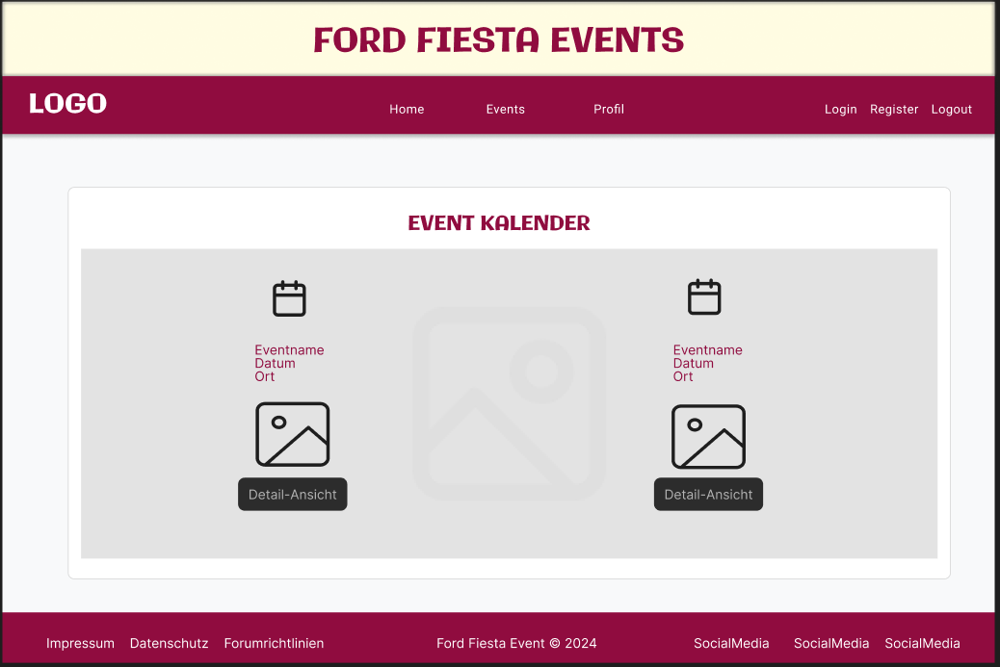

# Projekt: Veranstaltungskalender für Ford Fiesta (11/2001–08/2008)

### Nutzungsbedingungen

Bitte lies unsere [Nutzungsbedingungen](TERMS.md) sorgfältig durch, bevor du dieses Projekt verwendest oder weiterverwendest.

## Übersicht
Eine spezialisierte Plattform für Besitzer und Enthusiasten des Ford Fiesta (Modelljahr 11/2001–08/2008). Benutzer können Events finden, hinzufügen, bewerten und kommentieren. Events können Auto-Treffen, Reparatur-Workshops und Ausfahrten umfassen.

### Wichtige Komponenten und Funktionen

#### Benutzerverwaltung
- **Registrierung und Anmeldung**: Benutzer können sich registrieren und anmelden, um Events zu verwalten. AWS Cognito wird zur Benutzerverwaltung und Authentifizierung verwendet.
- **Profilverwaltung**: Benutzer können ihre Profile verwalten und persönliche Daten aktualisieren.

#### Event-Verwaltung
- **Event-Erstellung**: Benutzer können neue Events hinzufügen mit Details wie Titel, Beschreibung, Datum, Ort und Bild.
- **Event-Bearbeitung**: Benutzer können ihre eigenen Events bearbeiten.
- **Event-Löschung**: Benutzer können ihre eigenen Events löschen.
- **Event-Bewertung und Kommentare**: Benutzer können Events bewerten und Kommentare hinterlassen.
- **Event-Kalender**: Kalenderansicht zur Anzeige aller kommenden Events.

#### Benachrichtigungen und Erinnerungen
- **E-Mail-Benachrichtigungen**: Benutzer können sich für E-Mail-Benachrichtigungen für bevorstehende Events anmelden.
- **Push-Benachrichtigungen**: Optional können Push-Benachrichtigungen für neue oder bevorstehende Events implementiert werden.

#### Event-Suche und Filterung
- **Nach Datum filtern**: Benutzer können Events nach Datum filtern.
- **Nach Ort filtern**: Benutzer können Events nach Ort filtern.
- **Nach Kategorie filtern**: Benutzer können Events nach Kategorie (z.B. Treffen, Workshop, Ausfahrt) filtern.

### Technische Komponenten und Architektur

1. **Frontend**
   - **Technologie**: React
   - **Beschreibung**: Eine benutzerfreundliche Oberfläche zur Verwaltung und Anzeige von Events. Statische Dateien werden in AWS S3 gehostet und über CloudFront bereitgestellt.

2. **Backend**
   - **Technologie**: Express API
   - **Beschreibung**: API zur Verwaltung der Datenbankoperationen (CRUD) für Benutzer und Events.
   - **Auth**: AWS Cognito für Benutzerauthentifizierung und -verwaltung.

3. **Datenbank**
   - **Technologie**: MySQL
   - **Beschreibung**: Speicherung von Benutzerdaten, Events und Bewertungen. Gehostet auf AWS RDS.

4. **Deployment**
   - **Backend**: Gehostet auf AWS EC2
   - **Datenbank**: Gehostet auf AWS RDS
   - **Statische Dateien**: Gehostet auf AWS S3
   - **Content Delivery**: AWS CloudFront zur Beschleunigung der Auslieferung der statischen Dateien.
   - **Autoscaling**: AWS Autoscaling Groups zur automatischen Skalierung der Backend-Server.

### Datenstruktur und -management

#### Tabellenstruktur

**Benutzer**:
- ID
- Benutzername
- E-Mail
- Passwort (verschlüsselt)
- Erstellungsdatum

**Events**:
- ID
- Benutzer-ID (Referenz auf Benutzer)
- Titel
- Beschreibung
- Ort
- Datum
- Bild-URL
- Erstellungsdatum

**Bewertungen**:
- ID
- Event-ID (Referenz auf Event)
- Benutzer-ID (Referenz auf Benutzer)
- Bewertung (1-5)
- Kommentar
- Erstellungsdatum

## Benutzerrollen und Berechtigungen
- **Admin**: 
  - Kann alle Events verwalten
  - Kann Benutzer verwalten
  - Hat Zugriff auf erweiterte Statistiken
- **Standardbenutzer**: 
  - Kann eigene Events erstellen, bearbeiten und löschen
  - Kann Events bewerten und kommentieren

## Sicherheit und Datenschutz
- **Datenverschlüsselung**: Stellt sicher, dass sensible Daten wie Passwörter und persönliche Informationen verschlüsselt gespeichert werden.
- **Datenschutzrichtlinien**: Implementiere klare Datenschutzrichtlinien und stelle sicher, dass Benutzer über die Verwendung ihrer Daten informiert sind.

## Technische Komponenten im Detail

### Frontend (React)
- **State Management**: Nutze Context API zur Verwaltung des globalen Zustands.
- **Routing**: Verwende React Router für die Navigation zwischen verschiedenen Seiten (Login, Eventliste, Eventdetails, Eventerstellung).
- **Formulare**: Verwende Formik und Yup zur Validierung und Verwaltung von Formularen (Registrierung, Login, Eventerstellung).

### Backend (Express API)
- **Middleware**: Nutze Middleware wie `body-parser` zur Verarbeitung von JSON-Daten und `cors` zur Handhabung von Cross-Origin-Requests.
- **Sicherheitsmaßnahmen**: Implementiere Sicherheitsmaßnahmen wie Rate Limiting  
  - Schutz vor DDoS-Angriffen: Rate Limiting hilft, die Anzahl der Anfragen pro Zeiteinheit zu begrenzen, was hilft, deine Server vor übermäßigem Traffic zu schützen, der durch Distributed Denial-of-Service (DDoS) Angriffe verursacht werden könnte.

  - Verhinderung von Brute-Force-Angriffen: Durch das Begrenzen der Anzahl von Anfragen pro Benutzer oder IP-Adresse kannst du Brute-Force-Angriffe erschweren, bei denen Angreifer durch wiederholtes Ausprobieren von Passwörtern oder Zugangsdaten versuchen, unbefugten Zugriff zu erhalten.

  - Stabilität und Leistungsoptimierung: Indem du die Anzahl der gleichzeitigen Anfragen kontrollierst, kannst du sicherstellen, dass deine Server stabil bleiben und eine gleichbleibende Leistung für alle Benutzer bieten.

  - Kostenkontrolle: Rate Limiting kann auch helfen, Kosten zu kontrollieren, indem unnötiger oder missbräuchlicher Traffic reduziert wird, der zusätzliche Serverressourcen und Bandbreite verbraucht.

### Datenbank (MySQL)
- **ORM**: Nutze ein ORM wie Sequelize zur Verwaltung der Datenbankoperationen und zur Vereinfachung der Datenbankabfragen.
- **Backups**: Regelmäßige Backups der Datenbank zur Sicherstellung der Datenintegrität.

## API-Endpunkte

### Benutzer
- **POST** `/api/register`: Registrierung eines neuen Benutzers.
- **POST** `/api/login`: Anmeldung eines Benutzers.
- **GET** `/api/profile`: Abrufen der Benutzerdaten.
- **PUT** `/api/profile`: Aktualisieren der Benutzerdaten.

### Events
- **GET** `/api/events`: Abrufen aller Events.
- **GET** `/api/events/:id`: Abrufen eines spezifischen Events.
- **POST** `/api/events`: Erstellen eines neuen Events.
- **PUT** `/api/events/:id`: Bearbeiten eines bestehenden Events.
- **DELETE** `/api/events/:id`: Löschen eines Events.

### Bewertungen
- **POST** `/api/events/:id/rate`: Hinzufügen einer Bewertung zu einem Event.
- **GET** `/api/events/:id/ratings`: Abrufen aller Bewertungen eines Events.

### UI Design für V FORD FIESTA EVENTS

## Designrichtlinien

### Farbschema
- Primärfarbe: #FF5733 (Orange)
- Sekundärfarbe: #C70039 (Dunkelrot)
- Hervorhebungsfarbe: #900C3F (Dunkelviolett)
- Hintergrundfarbe:  #F8F9FA (Hellgrau)

### Schriftarten
- Primäre Schriftart: Galindo
- Sekundäre Schriftart: Roboto

## Komponenten und Layout

### Header
- Gestaltung des Header mit Logo
### Navbar
- Gestaltung der Hauptnavigation mit Logo und Menüpunkten für Benutzeraktionen.

### Startseite
- Kachelansicht der neuesten Events mit Titel und Bildvorschau.

### Eventdetails
- Detailansicht eines Events mit Beschreibung, Datum und Ort.

### Eventerstellung
- Formular zur Erstellung neuer Events mit Feldern für Titel, Beschreibung, Datum, Ort und Bildupload.

### Profilseite
- Anzeige der Benutzerinformationen mit Optionen zum Bearbeiten des Profils.

## Nutzung von Bootstrap

### Grid-System
- Verwendung des Bootstrap Grids zur responsiven Gestaltung der Seitenlayouts.

### Komponenten
- Integration von Bootstrap-Komponenten wie Modals, Forms und Cards für eine konsistente Benutzeroberfläche.

### Anpassung der Farben
- Anpassung des Bootstrap-Farbschemas an die definierten Primär-, Sekundär- und Hervorhebungsfarben.

### Responsives Design
- Sicherstellung, dass das Design auf verschiedenen Bildschirmgrößen gut funktioniert, insbesondere auf Mobilgeräten.

## Nächste Schritte

1. **Farbschema festlegen**: Definiere die genauen Farbwerte für das Farbschema.✅
2. **Bootstrap integrieren**: Füge Bootstrap in das Projekt ein und passe es an die eigenen Farben an.
3. **Komponenten entwickeln**: Entwickle die UI-Komponenten basierend auf den Designrichtlinien.
4. **Prototyping**: Erstelle Prototypen und überprüfe das Design auf Benutzerfreundlichkeit.✅
5. **Implementierung**: Implementiere das Design in die React-Anwendung unter Verwendung von Bootstrap.
6. **Testing**: Führe Tests durch, um sicherzustellen, dass das UI gut funktioniert und benutzerfreundlich ist.

---
### Mögliche Erweiterungen
- **Soziale Funktionen**: Integration von sozialen Medien zur einfachen Event-Teilung.
- **Geo-Location**: Automatische Erkennung des Standorts des Benutzers zur Anzeige von lokalen Events.
- **Event-Benachrichtigungen**: Erweiterte Benachrichtigungsoptionen wie SMS oder Push-Benachrichtigungen.
