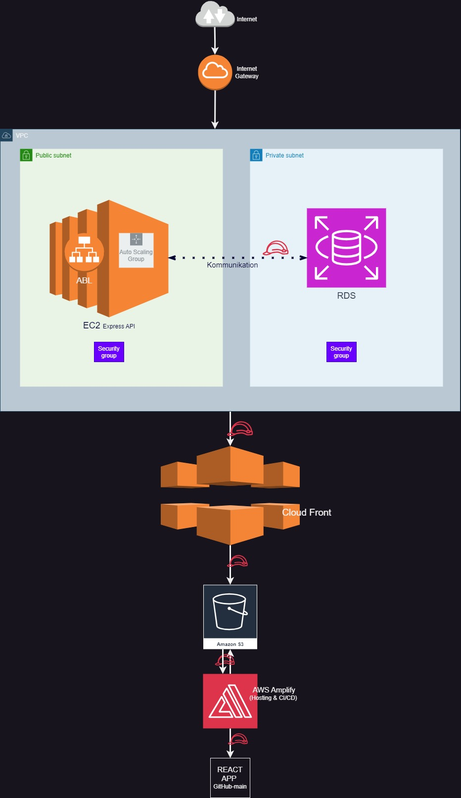

### Infrastrukturübersicht:

**1. VPC (Virtual Private Cloud):**
   - **Subnets:**
     - **Public Subnet:** Hier werden alle Ressourcen platziert, die direkt über das Internet zugänglich sein müssen.
     - **Private Subnet:** Hier wird die Datenbank gehostet, die nicht direkt über das Internet zugänglich sein sollte.

   - **Internet Gateway:** Ermöglicht den Ressourcen im Public Subnet, direkten Zugriff auf das Internet zu erhalten. Alle Internet-Anfragen laufen über das Internet Gateway.

**2. Frontend:**
   - **AWS S3:**
     - **Statisches Hosting:** Der S3-Bucket hostet die gebauten React-Dateien (HTML, CSS, JavaScript) und speichert zusätzlich vom Benutzer hochgeladene Bilder. Diese Dateien sind öffentlich zugänglich, um die Benutzeroberfläche und Benutzermedien über das Internet bereitzustellen.

   - **AWS Amplify:**
     - **Deployment und Verwaltung:** Alternativ oder ergänzend zu S3 kann AWS Amplify verwendet werden, um die React-App zu hosten und zu verwalten. Amplify bietet eine einfache Integration mit S3 für das Speichern und Bereitstellen von Inhalten sowie eine nahtlose Verwaltung von Deployment und Updates der App. Es nutzt AWS CloudFront für die schnelle Auslieferung der App weltweit und kann den Entwicklungsprozess durch integrierte CI/CD-Pipelines erheblich beschleunigen.
  
   - **AWS CloudFront:**
     - **Content Delivery Network (CDN):** CloudFront dient zur Beschleunigung der Auslieferung der statischen Inhalte, indem es diese Inhalte in globalen Edge Locations cached. Dies sorgt für eine verbesserte Ladezeit der React-App, unabhängig vom Standort des Nutzers.
  
**3. Backend:**
   - **AWS EC2:**
     - **Express API:** Die API wird auf einer oder mehreren EC2-Instanzen im Public Subnet gehostet.
     - **Autoscaling Group:** Automatische Skalierung der EC2-Instanzen basierend auf der Nachfrage. Diese Gruppe kann die Anzahl der EC2-Instanzen anpassen, um mit dem Traffic Schritt zu halten.
  
   - **Load Balancer:**
     - **Application Load Balancer (ALB):** Verteilt den eingehenden HTTP/HTTPS-Traffic auf die EC2-Instanzen im Public Subnet. Der ALB sorgt für die gleichmäßige Verteilung und bietet hohe Verfügbarkeit.
  
   - **JWT-basierte Authentifizierung:**
     - **Benutzerauthentifizierung und -verwaltung:** Ein eigenes Authentifizierungssystem auf Basis von JSON Web Tokens (JWT) verwaltet Benutzeranmeldungen, Registrierungen und Authentifizierungen. JWTs werden für die Autorisierung bei API-Anfragen verwendet.

**4. Datenbank:**
   - **AWS RDS (MySQL):**
     - **Datenbankserver:** MySQL-Datenbank, gehostet im Private Subnet. Der Zugriff erfolgt nur über die EC2-Instanzen im Public Subnet, was die Sicherheit der Datenbank erhöht.
     - **Multi-AZ Deployment:** Für hohe Verfügbarkeit und Ausfallsicherheit der Datenbank.

**5. Security:**
   - **VPC-Sicherheitsgruppen:**
     - **Frontend-Sicherheitsgruppe:** Erlaubt den Zugriff auf den S3-Bucket über HTTPS.
     - **Backend-Sicherheitsgruppe:** Beschränkt den Zugriff auf die EC2-Instanzen und die RDS-Datenbank. Der Load Balancer kann Traffic an die EC2-Instanzen weiterleiten, und nur diese können auf die Datenbank zugreifen.
  
   - **IAM-Rollen:** Verwaltung von Zugriffsberechtigungen für die AWS-Ressourcen, z.B. für den Zugriff von EC2-Instanzen auf S3-Buckets oder RDS.

### Infrastruktur-Zeichnungen

### Endgültige Infrastruktur:

- Die Infrastruktur ist mal geplant und sieht vielversprechend aus – jetzt heißt es nur noch: *"Auf geht's, mal sehen, wie sich das ganze Ding entwickelt!"*

